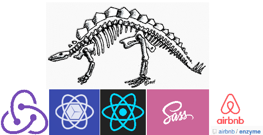
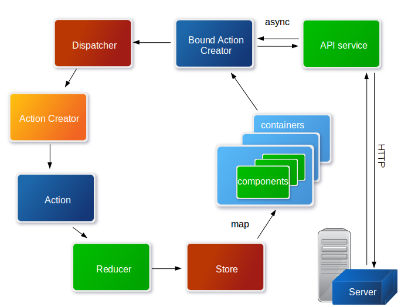

# React Skeleton

> easy start of your prototype




## Main Conception

Code was organized according with React + Redux philosophy:

+ [Actions, Action Creators and Bound Action Creators](http://redux.js.org/docs/basics/Actions.html#action-creators)
+ [Reducer for each page](http://redux.js.org/docs/basics/Reducers.html)
+ [Single Application Store](http://redux.js.org/docs/basics/Store.html)
+ [Unidirectional Data Flow](http://redux.js.org/docs/basics/DataFlow.html)


### Current architecture


## Start App

Clone repo
```
sudo git clone https://archik@bitbucket.org/archik/react-skeleton.git
```

Install all dependencies
```
npm install
```


Rebuild node-sass for your OS configuration
```
npm rebuild node-sass
```

Start app
```
npm start
```

## Generate Documentation

```
npm run jsdoc
```

Check docs/index.html


## Testing

Start unit tests:
```
npm test
```


Reports:
```
npm run test-r
```

## Build

Build app
```
npm run build
```

Check dist folder

You can configure PUBLIC_URI for assets and API_URI for server api using following variables /index.html :
```
  window.PUBLIC_URI = '/'; // instead you can use 'relative/path/to/assets' or '/assets/'
  window.API_URI = '';     // instead you can use 'relative/path/to/api' or 'https://195.168.93.166'
```

or just use command sed:
```
sed -e "s%PUBLIC_URI = '/';%PUBLIC_URI = '/app6';%g" index.html > new_index.html
```

## External links

+ [React](https://facebook.github.io/react)
+ [Redux](http://redux.js.org/docs/introduction)
+ [UI Framework](http://react-toolbox.com)
+ [Webpack](https://webpack.github.io/)
+ [Enzyme](http://airbnb.io/enzyme)
+ [Mocha](https://mochajs.org)
+ [Chai](http://chaijs.com)
+ [Sinon](http://sinonjs.org)
+ [JSDoc](http://usejsdoc.org/)
